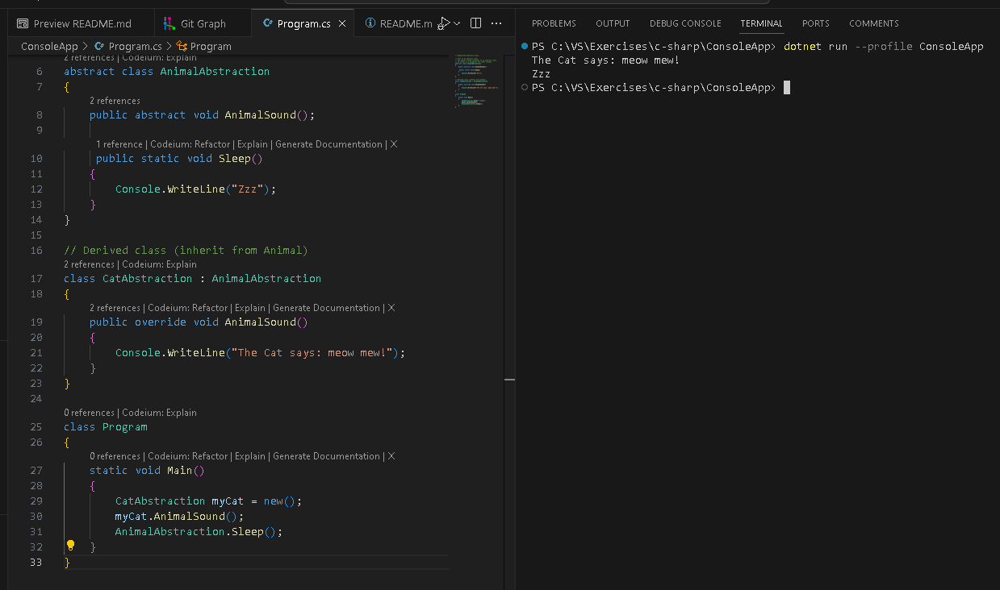

# C# Exercises

## 1. Basic OOP concept

Git-branch: [basic-OOP-concept](https://github.com/AliSafari-IT/Learn-Csharp/tree/basic-OOP-concept)

This code is a neat demonstration of basic OOP principles in action, like different gears coming together to drive a well-functioning machine!

### Key Concepts Illustrated

- **Inheritance**: `Car` inherits from `Vehicle`, so it has access to the `Vehicle`'s members (`Brand` and `Honk`), plus its own (`ModelName`, `MainColor`, `GetAdjustedColor`).

- **Static Method**: `Honk` is a static method, illustrating how such methods are called on the class itself rather than on instances.

- **Instance Method and Fields**: `GetAdjustedColor` is an instance method, working with instance fields like `MainColor`.

- **Object Instantiation**: `Car myCar = new Car();` shows how to create an instance of a class.

- **Method Calling**: The way `GetAdjustedColor` and `Honk` are called demonstrates calling instance and static methods, respectively.

- **Console Operations**: The code shows how to write to the console and change the console's foreground color.

```csharp
using System;

class Vehicle  // base class (parent) 
{
    public string Brand = "Ford";  // Vehicle field
    public static void Honk()      // Vehicle method 
    {
        Console.WriteLine("Tuut, tuut!");
    }
}

class Car : Vehicle  // derived class (child)
{
    public string ModelName = "Mustang";  // Car field
    public ConsoleColor MainColor = ConsoleColor.Red; // Car color

    public ConsoleColor GetAdjustedColor()
    {
        if (MainColor == ConsoleColor.Green)
        {
            return ConsoleColor.DarkGreen;
        }

        return MainColor;
    }
}

class Program
{
    static void Main()
    {
        Car myCar = new Car();
        ConsoleColor vc = myCar.GetAdjustedColor();

        Console.ForegroundColor = ConsoleColor.White;
        Console.Write($"{myCar.Brand} {myCar.ModelName} (Color: ");
        Console.ForegroundColor = vc;
        Console.Write($"{vc}");
        Console.ForegroundColor = ConsoleColor.White;
        Console.WriteLine($")");
        Vehicle.Honk();
    }
}

```

> ***Output***


## 2. Polymorphism in Action

Git-branch: [Polymorphism-and-Overriding](https://github.com/AliSafari-IT/Learn-Csharp/tree/Polymorphism-and-Overriding)

It's a concept where objects of different classes can be treated as objects of a common superclass. The word itself comes from Greek, meaning "many forms."

In more technical terms, polymorphism allows methods to do different things based on the object they are acting upon. This means we can use a single interface to represent different underlying forms (data types).

### Base Class: Animal

class Animal: This is our base (or parent) class. It represents a generic animal.
public virtual void animalSound(): This method is marked as virtual, which means it can be overridden in derived classes. It provides a default implementation that just prints "The animal makes a sound".

``` csharp
class Animal  // Base class (parent) 
{
    public virtual void AnimalSound()
    {
        Console.WriteLine("The animal makes a sound!");
    }
}

// Define derived classes `Cat` and `Dog` that override the `animalSound()` method.
class Cat : Animal  // Derived class (child) 
{
    public override void AnimalSound()
    {
        Console.WriteLine("The cat says: meow miauw!");
    }
}

class Dog : Animal  // Derived class (child) 
{
    public override void AnimalSound()
    {
        Console.WriteLine("The dog says:  bow-wow!");
    }
}

```

The beauty of this code lies in how it demonstrates polymorphism. Both `myCat` and `myDog` are declared as `Animal` type but actually refer to `Cat` and `Dog` objects. Due to method overriding and the way C# handles polymorphism, the correct `animalSound` method is called for each object.

```csharp
class Program
{
    static void Main(string[] args)
    {
        // Create an Animal, a Cat, and a Dog
        Animal myAnimal = new();  
        Animal myCat = new Cat();  
        Animal myDog = new Dog(); 

        // Call the Animal's AnimalSound method on the Animal object
        myAnimal.AnimalSound();
        // Call the Animal's AnimalSound method on the Cat object
        myCat.AnimalSound();
        // Call the Animal's AnimalSound method on the Dog object
        myDog.AnimalSound();
    }
}
```

In summary, this code illustrates how we can use a single interface (`animalSound` method in `Animal`) to achieve different behaviors based on the actual object type (`Cat` or `Dog`). It's like having a universal remote that magically adjusts its controls based on the device it's pointing at!

In essence, polymorphism is about leveraging inheritance to create a more flexible and integrated interface. It's a cornerstone of object-oriented programming, allowing for more dynamic and versatile code.

## 3. Abstraction in Action

Git-branch: [Abstract-Classes-and-Methods](https://github.com/AliSafari-IT/Learn-Csharp/tree/Abstract-Classes-and-Methods)

```csharp
abstract class AnimalAbstraction
{

    // This is an abstract method. 
    // It has no body and must be implemented by any non-abstract 
    // class that inherits from this abstract class.
    public abstract void AnimalSound();

    // This is a regular (non-abstract) method in the abstract class. 
    // It has a body and provides default behavior (printing "Zzz") that derived classes inherit.
    public static void Sleep()
    {
        // while sharing common behaviors like `sleep`, animals can have their own sound.
        Console.WriteLine("Zzz");
    }
}
```

**Abstraction**: The `AnimalAbstraction` class provides a level of abstraction. It defines a general concept (an animal) without specifying all the details (how it makes a sound). Those details are provided in the derived classes.

```csharp
class CatAbstraction : AnimalAbstraction
{
    // This class inherits from AnimalAbstraction. Being non-abstract, it must implement the abstract method AnimalSound.
    public override void AnimalSound()
    {
        // The body of animalSound() is provided here
        Console.WriteLine("The Cat says: meow mew!");
    }
}
```

**Code Reusability and Structure**: The abstract class allows we to define methods that can be shared by derived classes (`sleep`) and methods that must be individualized by each derived class (`AnimalSound`).

```csharp
class Program
{
    static void Main()
    {
        CatAbstraction myCat = new(); // Create a Cat object
        myCat.AnimalSound();  // Call the abstract method
        AnimalAbstraction.Sleep();  // Call the regular method
    }
}
```

By using an abstract class, we create a contract for the derived classes and establish a clear structure for our code. It's a powerful way to leverage polymorphism, ensuring that each animal class provides its own sound while sharing common behaviors like `sleep`.

> ***Output***


## 4. Interface in Action

### Interface: IAnimal

Git-branch: [Interfaces](https://github.com/AliSafari-IT/Learn-Csharp/tree/Interfaces)

*IAnimal*: This is an interface, a contract that defines certain capabilities (methods) without implementing them. In C#, interfaces provide a way to achieve abstraction.

```csharp
// Interface
interface IAnimal 
{
  void AnimalSound(); // interface method (does not have a body)
}
```

Method declaration within IAnimal. It specifies that any class implementing this interface must provide an implementation for AnimalSound. Unlike methods in classes, interface methods don't have a body.

```csharp
internal class Cat : IAnimal 
{
  public void AnimalSound() 
  {
    // The body of animalSound() is provided here
    Console.WriteLine("The Cat says: meow mew"); 
  }
}

class Program 
{
  static void Main(string[] args) 
  {
    Cat myCat = new();  // Create a Cat object
    myCat.AnimalSound();
  }
}
```

The interface `IAnimal` acts as a template, ensuring that all classes that implement it, like `Cat`, provide specific functionality (`AnimalSound` method).

This code illustrates how interfaces promote a clear separation of definition and implementation. It also shows how they can be used to enforce certain behaviors in implementing classes.

```csharp
// Implement multiple interfaces
// To implement multiple interfaces, separate them with a comma:
class DemoClass : IFirstInterface, ISecondInterface 
{
}
```

Interfaces are central to achieving abstraction in C# and are fundamental to many design patterns.


